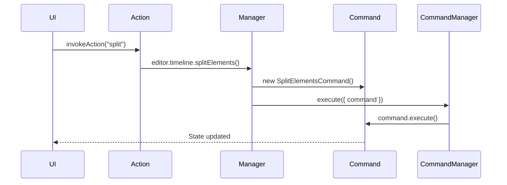

OpenCut implements a robust undo/redo system using the command pattern. Every modifying operation is wrapped in a command that can be executed, undone, and redone.

## Why commands?

The command pattern provides:

<CardGroup cols={2}>
  <Card title="Undo/redo support" icon="rotate-left">
    Every operation can be reversed and re-applied.
  </Card>
  
  <Card title="State encapsulation" icon="box">
    Commands save necessary state for reversal.
  </Card>
  
  <Card title="Batch operations" icon="layer-group">
    Multiple commands can be executed as a single undoable unit.
  </Card>
  
  <Card title="History tracking" icon="clock-rotate-left">
    Complete history of all operations for debugging and analysis.
  </Card>
</CardGroup>

## Command interface

All commands extend the base `Command` class:

```typescript apps/web/src/lib/commands/base-command.ts
export abstract class Command {
  abstract execute(): void;

  undo(): void {
    throw new Error("Undo not implemented for this command");
  }

  redo(): void {
    this.execute();
  }
}
```

## CommandManager API

The CommandManager handles command execution and history:

```typescript apps/web/src/core/managers/commands.ts
export class CommandManager {
  private history: Command[] = [];
  private redoStack: Command[] = [];

  execute({ command }: { command: Command }): Command {
    command.execute();
    this.history.push(command);
    this.redoStack = [];
    return command;
  }

  push({ command }: { command: Command }): void {
    this.history.push(command);
    this.redoStack = [];
  }

  undo(): void {
    if (this.history.length === 0) return;
    const command = this.history.pop();
    command?.undo();
    if (command) {
      this.redoStack.push(command);
    }
  }

  redo(): void {
    if (this.redoStack.length === 0) return;
    const command = this.redoStack.pop();
    command?.redo();
    if (command) {
      this.history.push(command);
    }
  }

  canUndo(): boolean {
    return this.history.length > 0;
  }

  canRedo(): boolean {
    return this.redoStack.length > 0;
  }

  clear(): void {
    this.history = [];
    this.redoStack = [];
  }
}
```

## Using commands

### Basic usage

```typescript
import { EditorCore } from '@/core';
import { SplitElementsCommand } from '@/lib/commands/timeline';

const editor = EditorCore.getInstance();

// Execute a command
const command = new SplitElementsCommand(
  [{ trackId: 'track-1', elementId: 'element-1' }],
  5.5,
  'both'
);
editor.command.execute({ command });

// Undo the command
editor.command.undo();

// Redo the command
editor.command.redo();

// Check if undo/redo is available
if (editor.command.canUndo()) {
  editor.command.undo();
}
```

### Through manager methods

Most operations are wrapped by manager methods:

```typescript
import { useEditor } from '@/hooks/use-editor';

function MyComponent() {
  const editor = useEditor();

  const handleSplit = () => {
    // Automatically creates and executes a command
    editor.timeline.splitElements({
      elements: [{ trackId: 'track-1', elementId: 'element-1' }],
      splitTime: 5.5,
      retainSide: 'both'
    });
  };

  return <button onClick={handleSplit}>Split</button>;
}
```

Under the hood, `timeline.splitElements()` does:

```typescript apps/web/src/core/managers/timeline-manager.ts
splitElements({
  elements,
  splitTime,
  retainSide = "both",
}: {
  elements: { trackId: string; elementId: string }[];
  splitTime: number;
  retainSide?: "both" | "left" | "right";
}): { trackId: string; elementId: string }[] {
  const command = new SplitElementsCommand(elements, splitTime, retainSide);
  this.editor.command.execute({ command });
  return command.getRightSideElements();
}
```

## Creating a command

Here's a complete example of implementing a command:

```typescript
import { Command } from '@/lib/commands/base-command';
import { EditorCore } from '@/core';
import type { TimelineTrack } from '@/types/timeline';

export class DeleteElementsCommand extends Command {
  private savedState: TimelineTrack[] | null = null;
  private deletedElements: Array<{
    trackId: string;
    elementId: string;
  }> = [];

  constructor(
    private elements: Array<{
      trackId: string;
      elementId: string;
    }>
  ) {
    super();
  }

  execute(): void {
    const editor = EditorCore.getInstance();
    
    // Save current state for undo
    this.savedState = editor.timeline.getTracks();
    this.deletedElements = [...this.elements];

    // Perform the deletion
    const updatedTracks = this.savedState.map((track) => {
      return {
        ...track,
        elements: track.elements.filter((element) => {
          return !this.deletedElements.some(
            (del) => del.trackId === track.id && del.elementId === element.id
          );
        }),
      };
    });

    editor.timeline.updateTracks(updatedTracks);
  }

  undo(): void {
    if (this.savedState) {
      const editor = EditorCore.getInstance();
      editor.timeline.updateTracks(this.savedState);
    }
  }
}
```

## Batch commands

Combine multiple commands into a single undoable operation:

```typescript apps/web/src/lib/commands/batch-command.ts
import { Command } from "./base-command";

export class BatchCommand extends Command {
  constructor(private commands: Command[]) {
    super();
  }

  execute(): void {
    for (const command of this.commands) {
      command.execute();
    }
  }

  undo(): void {
    // Undo in reverse order
    for (const command of [...this.commands].reverse()) {
      command.undo();
    }
  }

  redo(): void {
    for (const command of this.commands) {
      command.execute();
    }
  }
}
```

### Using batch commands

```typescript
import { BatchCommand } from '@/lib/commands';
import { UpdateElementCommand } from '@/lib/commands/timeline';

const editor = EditorCore.getInstance();

// Create multiple update commands
const commands = [
  new UpdateElementCommand('track-1', 'element-1', { opacity: 0.5 }),
  new UpdateElementCommand('track-1', 'element-2', { opacity: 0.7 }),
  new UpdateElementCommand('track-2', 'element-3', { opacity: 0.3 }),
];

// Execute as single undoable operation
const batchCommand = new BatchCommand(commands);
editor.command.execute({ command: batchCommand });

// Single undo reverts all changes
editor.command.undo();
```

## Command organization

Commands are organized by domain in the codebase:

```
apps/web/src/lib/commands/
├── base-command.ts          # Base Command class
├── batch-command.ts         # BatchCommand for grouping
├── index.ts                 # Exports
├── timeline/
│   ├── track/
│   │   ├── add-track.ts
│   │   ├── remove-track.ts
│   │   ├── toggle-track-mute.ts
│   │   └── toggle-track-visibility.ts
│   ├── element/
│   │   ├── insert-element.ts
│   │   ├── delete-elements.ts
│   │   ├── split-elements.ts
│   │   ├── update-element.ts
│   │   ├── move-elements.ts
│   │   └── duplicate-elements.ts
│   └── clipboard/
│       └── paste.ts
├── scene/
│   ├── create-scene.ts
│   ├── delete-scene.ts
│   ├── rename-scene.ts
│   └── toggle-bookmark.ts
├── media/
│   ├── add-media-asset.ts
│   └── remove-media-asset.ts
└── project/
    └── update-project-settings.ts
```

## Execute vs push

The CommandManager has two methods for adding commands to history:

<Tabs>
  <Tab title="execute()">
    **Use when the command hasn't been executed yet:**

    ```typescript
    const command = new SplitElementsCommand(elements, time, side);
    editor.command.execute({ command });
    // Calls command.execute() then adds to history
    ```

    This is the most common case.
  </Tab>
  
  <Tab title="push()">
    **Use when the command was already executed:**

    ```typescript
    const command = new SplitElementsCommand(elements, time, side);
    command.execute();  // Manual execution
    editor.command.push({ command });
    // Just adds to history without executing
    ```

    This is useful for preview operations that commit later.
  </Tab>
</Tabs>

## Preview operations

Some operations support a preview mode before committing:

```typescript
import { useEditor } from '@/hooks/use-editor';

function ElementDrag() {
  const editor = useEditor();

  const handleDragStart = () => {
    // Start preview mode
    editor.timeline.previewElements({
      updates: [{
        trackId: 'track-1',
        elementId: 'element-1',
        updates: { transform: { x: 100, y: 50 } }
      }]
    });
  };

  const handleDragEnd = (commit: boolean) => {
    if (commit) {
      // Commit the preview to history
      editor.timeline.commitPreview();
    } else {
      // Discard the preview
      editor.timeline.discardPreview();
    }
  };

  return <div>...</div>;
}
```

## Command best practices

<CardGroup cols={2}>
  <Card title="Save minimal state" icon="floppy-disk">
    Only save the state necessary to undo. Don't save the entire editor state.
  </Card>
  
  <Card title="Immutable operations" icon="lock">
    Use immutable updates. Don't mutate saved state directly.
  </Card>
  
  <Card title="Use batch for groups" icon="layer-group">
    Combine related operations into a BatchCommand for single undo.
  </Card>
  
  <Card title="Test undo/redo" icon="vial">
    Always test that undo properly reverses the operation.
  </Card>
</CardGroup>

## Relationship with actions

Actions and commands work together:



<Info>
  **Actions** are "what triggered this" (user intent), while **commands** are "how to do it and undo it" (implementation).
</Info>

## Related concepts

- [EditorCore](/concepts/editor-core) - The CommandManager is accessed via EditorCore
- [Actions](/concepts/actions) - Actions trigger commands for user operations
- [Timeline](/concepts/timeline) - Timeline operations are implemented as commands
- [Scenes](/concepts/scenes) - Scene operations are implemented as commands
