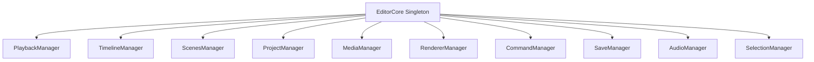

EditorCore is the central singleton that manages all editor state through specialized managers. It provides a consistent API for accessing and manipulating the editor's functionality.

## Architecture overview

The EditorCore singleton coordinates all editor operations through domain-specific managers:



## Core implementation

The EditorCore class is implemented as a singleton pattern with private constructor:

```typescript apps/web/src/core/index.ts
export class EditorCore {
  private static instance: EditorCore | null = null;

  public readonly command: CommandManager;
  public readonly playback: PlaybackManager;
  public readonly timeline: TimelineManager;
  public readonly scenes: ScenesManager;
  public readonly project: ProjectManager;
  public readonly media: MediaManager;
  public readonly renderer: RendererManager;
  public readonly save: SaveManager;
  public readonly audio: AudioManager;
  public readonly selection: SelectionManager;

  private constructor() {
    this.command = new CommandManager();
    this.playback = new PlaybackManager(this);
    this.timeline = new TimelineManager(this);
    this.scenes = new ScenesManager(this);
    this.project = new ProjectManager(this);
    this.media = new MediaManager(this);
    this.renderer = new RendererManager(this);
    this.save = new SaveManager(this);
    this.audio = new AudioManager(this);
    this.selection = new SelectionManager(this);
    this.save.start();
  }

  static getInstance(): EditorCore {
    if (!EditorCore.instance) {
      EditorCore.instance = new EditorCore();
    }
    return EditorCore.instance;
  }

  static reset(): void {
    EditorCore.instance = null;
  }
}
```

## Manager responsibilities

Each manager handles a specific domain of editor functionality:

<AccordionGroup>
  <Accordion title="PlaybackManager">
    Controls video playback state, seeking, and frame navigation.
  </Accordion>
  
  <Accordion title="TimelineManager">
    Manages tracks, elements, and timeline operations like splitting, trimming, and moving elements.
  </Accordion>
  
  <Accordion title="ScenesManager">
    Handles scene creation, switching, deletion, and bookmark management.
  </Accordion>
  
  <Accordion title="ProjectManager">
    Manages project-level state including settings, metadata, and active project.
  </Accordion>
  
  <Accordion title="MediaManager">
    Handles media asset loading, processing, and management.
  </Accordion>
  
  <Accordion title="RendererManager">
    Controls video rendering and canvas output.
  </Accordion>
  
  <Accordion title="CommandManager">
    Implements undo/redo functionality through the command pattern.
  </Accordion>
  
  <Accordion title="SaveManager">
    Handles auto-saving and project persistence.
  </Accordion>
  
  <Accordion title="AudioManager">
    Manages audio playback, mixing, and processing.
  </Accordion>
  
  <Accordion title="SelectionManager">
    Tracks selected elements and provides selection utilities.
  </Accordion>
</AccordionGroup>

## When to use what

The method you use to access EditorCore depends on your context:

<Tabs>
  <Tab title="In React components">
    **Always use the `useEditor()` hook:**

    ```typescript
    import { useEditor } from '@/hooks/use-editor';

    function MyComponent() {
      const editor = useEditor();
      const tracks = editor.timeline.getTracks();

      // Call methods
      editor.timeline.addTrack({ type: 'video' });

      // Display data (auto re-renders on changes)
      return <div>{tracks.length} tracks</div>;
    }
    ```

    The hook:
    - Returns the singleton instance
    - Subscribes to all manager changes
    - Automatically re-renders when state changes
  </Tab>
  
  <Tab title="Outside React">
    **Use `EditorCore.getInstance()` directly:**

    ```typescript
    import { EditorCore } from '@/core';

    // In utilities, event handlers, or non-React code
    const editor = EditorCore.getInstance();
    await editor.renderer.export({ format: 'mp4', quality: 'high' });
    ```
  </Tab>
</Tabs>

<Note>
  Never instantiate EditorCore directly. Always use `getInstance()` or the `useEditor()` hook to ensure you're working with the singleton instance.
</Note>

## The useEditor hook

The `useEditor()` hook is implemented using React's `useSyncExternalStore` to provide reactive state updates:

```typescript apps/web/src/hooks/use-editor.ts
export function useEditor(): EditorCore {
  const editor = useMemo(() => EditorCore.getInstance(), []);
  const versionRef = useRef(0);

  const subscribe = useCallback(
    (onStoreChange: () => void) => {
      const handleStoreChange = () => {
        versionRef.current += 1;
        onStoreChange();
      };

      const unsubscribers = [
        editor.playback.subscribe(handleStoreChange),
        editor.timeline.subscribe(handleStoreChange),
        editor.scenes.subscribe(handleStoreChange),
        editor.project.subscribe(handleStoreChange),
        editor.media.subscribe(handleStoreChange),
        editor.renderer.subscribe(handleStoreChange),
        editor.selection.subscribe(handleStoreChange),
      ];

      return () => {
        for (const unsubscribe of unsubscribers) {
          unsubscribe();
        }
      };
    },
    [editor],
  );

  const getSnapshot = useCallback(() => versionRef.current, []);

  useSyncExternalStore(subscribe, getSnapshot, getSnapshot);

  return editor;
}
```

The hook subscribes to all manager changes and triggers re-renders when any manager state updates.

## Manager subscription pattern

Each manager implements a subscription pattern for reactive updates:

```typescript
class ExampleManager {
  private listeners = new Set<() => void>();

  subscribe(listener: () => void): () => void {
    this.listeners.add(listener);
    return () => this.listeners.delete(listener);
  }

  private notify(): void {
    this.listeners.forEach((fn) => fn());
  }

  // Call notify() after state changes
  updateState(newState) {
    // ... update logic
    this.notify();
  }
}
```

## Best practices

<CardGroup cols={2}>
  <Card title="Use the right access method" icon="code">
    Use `useEditor()` in React components and `getInstance()` in utilities.
  </Card>
  
  <Card title="Access managers directly" icon="layer-group">
    Call manager methods directly: `editor.timeline.addTrack()` instead of going through EditorCore.
  </Card>
  
  <Card title="Don't create new instances" icon="ban">
    Never call `new EditorCore()`. Always use the singleton pattern.
  </Card>
  
  <Card title="Let managers handle state" icon="database">
    Don't duplicate manager state in local component state.
  </Card>
</CardGroup>

## Related concepts

- [Timeline system](/concepts/timeline) - Understanding the TimelineManager
- [Scenes](/concepts/scenes) - Working with the ScenesManager
- [Commands](/concepts/commands) - Using the CommandManager for undo/redo
- [Actions](/concepts/actions) - Triggering operations through the actions system
