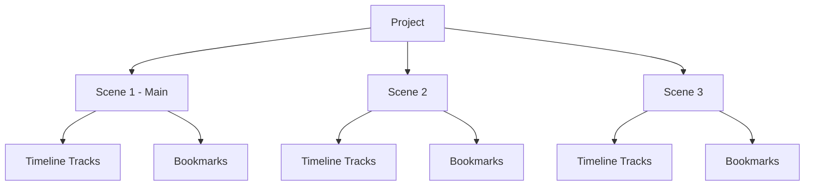

Scenes provide a powerful way to organize complex video projects. Each scene has its own timeline with independent tracks and elements, plus bookmarks for marking important moments.

## What is a scene?

A scene is a self-contained timeline within your project. Think of scenes as chapters in your video or different takes you can switch between.

```typescript apps/web/src/types/timeline.ts
export interface TScene {
  id: string;
  name: string;
  isMain: boolean;        // One scene must be marked as main
  tracks: TimelineTrack[];
  bookmarks: Bookmark[];
  createdAt: Date;
  updatedAt: Date;
}
```

## Scene structure



<Info>
  Each scene maintains its own timeline state independently. Changes in one scene don't affect others.
</Info>

## ScenesManager API

### Creating and managing scenes

```typescript
// Create a new scene
const sceneId = await editor.scenes.createScene({
  name: 'Take 2',
  isMain: false
});

// Switch to a scene
await editor.scenes.switchToScene({ sceneId });

// Rename a scene
await editor.scenes.renameScene({
  sceneId,
  name: 'Final Take'
});

// Delete a scene (cannot delete the main scene)
await editor.scenes.deleteScene({ sceneId });

// Get active scene
const activeScene = editor.scenes.getActiveScene();

// Get all scenes
const allScenes = editor.scenes.getScenes();
```

<Warning>
  You cannot delete the main scene. At least one scene with `isMain: true` must always exist in the project.
</Warning>

### Scene switching implementation

Here's how scene switching is implemented:

```typescript apps/web/src/core/managers/scenes-manager.ts
async switchToScene({ sceneId }: { sceneId: string }): Promise<void> {
  const targetScene = this.list.find((s) => s.id === sceneId);

  if (!targetScene) {
    throw new Error("Scene not found");
  }

  const activeProject = this.editor.project.getActive();

  if (activeProject) {
    const updatedProject = {
      ...activeProject,
      currentSceneId: sceneId,
      metadata: {
        ...activeProject.metadata,
        updatedAt: new Date(),
      },
    };

    this.editor.project.setActiveProject({ project: updatedProject });
  }

  this.active = targetScene;
  this.notify();
}
```

## Bookmarks

Bookmarks let you mark important moments on the timeline with optional notes and colors.

```typescript apps/web/src/types/timeline.ts
export interface Bookmark {
  time: number;       // Timeline position in seconds
  note?: string;      // Optional description
  color?: string;     // Optional color for visual identification
  duration?: number;  // Optional duration for ranged bookmarks
}
```

### Working with bookmarks

```typescript
// Toggle bookmark at current time
await editor.scenes.toggleBookmark({ time: 5.5 });

// Check if time is bookmarked
const isBookmarked = editor.scenes.isBookmarked({ time: 5.5 });

// Get bookmark at time
const bookmark = editor.scenes.getBookmarkAtTime({ time: 5.5 });

// Update bookmark properties
await editor.scenes.updateBookmark({
  time: 5.5,
  updates: {
    note: 'Important scene transition',
    color: '#ff6b6b',
    duration: 2  // Make it a ranged bookmark
  }
});

// Move bookmark to different time
await editor.scenes.moveBookmark({
  fromTime: 5.5,
  toTime: 7.0
});

// Remove bookmark
await editor.scenes.removeBookmark({ time: 5.5 });
```

<Tip>
  Bookmarks are frame-accurate. The system automatically snaps bookmark times to the nearest frame based on your project's FPS.
</Tip>

## Scene lifecycle

Understanding how scenes are initialized and managed:

```typescript apps/web/src/core/managers/scenes-manager.ts
initializeScenes({
  scenes,
  currentSceneId,
}: {
  scenes: TScene[];
  currentSceneId?: string;
}): void {
  // Ensure at least one main scene exists
  const ensuredScenes = ensureMainScene({ scenes });
  
  // Ensure each scene has a main track
  const { scenes: scenesWithMainTracks, hasAddedMainTrack } =
    this.ensureScenesHaveMainTrack({ scenes: ensuredScenes });
  
  // Set active scene
  const currentScene = currentSceneId
    ? scenesWithMainTracks.find((s) => s.id === currentSceneId)
    : null;

  const fallbackScene = getMainScene({ scenes: scenesWithMainTracks });

  this.list = scenesWithMainTracks;
  this.active = currentScene || fallbackScene;
  this.notify();
}
```

## Scene commands

All scene operations are implemented using the command pattern for undo/redo support:

<CardGroup cols={2}>
  <Card title="CreateSceneCommand" icon="plus">
    Creates a new scene and adds it to the project.
  </Card>
  
  <Card title="DeleteSceneCommand" icon="trash">
    Removes a scene (with validation to prevent deleting main scene).
  </Card>
  
  <Card title="RenameSceneCommand" icon="pen">
    Changes the name of an existing scene.
  </Card>
  
  <Card title="ToggleBookmarkCommand" icon="bookmark">
    Adds or removes a bookmark at a specific time.
  </Card>
  
  <Card title="UpdateBookmarkCommand" icon="edit">
    Modifies bookmark properties like note, color, or duration.
  </Card>
  
  <Card title="MoveBookmarkCommand" icon="arrow-right">
    Moves a bookmark from one time to another.
  </Card>
  
  <Card title="RemoveBookmarkCommand" icon="xmark">
    Deletes a bookmark at a specific time.
  </Card>
</CardGroup>

## Timeline integration

The TimelineManager retrieves its track data from the active scene:

```typescript apps/web/src/core/managers/timeline-manager.ts
getTracks(): TimelineTrack[] {
  return this.editor.scenes.getActiveScene()?.tracks ?? [];
}

updateTracks(newTracks: TimelineTrack[]): void {
  this.editor.scenes.updateSceneTracks({ tracks: newTracks });
  this.notify();
}
```

This tight integration means:
- Timeline operations automatically update the active scene
- Switching scenes instantly changes the visible timeline
- Each scene's timeline state is preserved independently

## Use cases for scenes

<AccordionGroup>
  <Accordion title="Multiple takes">
    Create a scene for each take of the same content. Switch between them to compare and choose the best version.
  </Accordion>
  
  <Accordion title="Project chapters">
    Organize long videos into logical chapters. Each scene represents a major section of your video.
  </Accordion>
  
  <Accordion title="A/B variations">
    Create alternative versions of the same content with different edits, effects, or timing.
  </Accordion>
  
  <Accordion title="Template variations">
    Build multiple variations of a video template with different content but similar structure.
  </Accordion>
</AccordionGroup>

## Best practices

<CardGroup cols={2}>
  <Card title="Name scenes clearly" icon="tag">
    Use descriptive names like "Intro", "Take 3", or "Short Version" instead of generic names.
  </Card>
  
  <Card title="Use bookmarks liberally" icon="bookmark">
    Mark important moments, transitions, or areas that need review with bookmarks.
  </Card>
  
  <Card title="Keep one main scene" icon="star">
    Designate your primary edit as the main scene for easy identification.
  </Card>
  
  <Card title="Clean up unused scenes" icon="broom">
    Delete scenes you're no longer using to keep your project organized.
  </Card>
</CardGroup>

## Related concepts

- [EditorCore](/concepts/editor-core) - Understanding the singleton architecture
- [Timeline](/concepts/timeline) - Working with tracks and elements within scenes
- [Commands](/concepts/commands) - Scene operations use commands for undo/redo
- [Actions](/concepts/actions) - User-triggered scene operations
