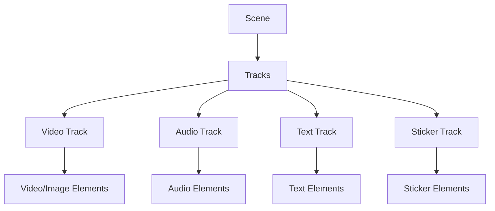

The timeline system in OpenCut provides multi-track editing capabilities through the TimelineManager. It manages tracks, elements, and all timeline operations.

## Timeline structure

The timeline is organized hierarchically:



## Track types

OpenCut supports four track types:

<CardGroup cols={2}>
  <Card title="Video tracks" icon="video">
    Hold video and image elements. Support muting and visibility toggling.
  </Card>
  
  <Card title="Audio tracks" icon="music">
    Hold audio elements. Support muting.
  </Card>
  
  <Card title="Text tracks" icon="font">
    Hold text overlay elements. Support visibility toggling.
  </Card>
  
  <Card title="Sticker tracks" icon="face-smile">
    Hold sticker elements. Support visibility toggling.
  </Card>
</CardGroup>

## Track interface

```typescript apps/web/src/types/timeline.ts
export type TrackType = "video" | "text" | "audio" | "sticker";

export interface VideoTrack extends BaseTrack {
  type: "video";
  elements: (VideoElement | ImageElement)[];
  isMain: boolean;
  muted: boolean;
  hidden: boolean;
}

export interface AudioTrack extends BaseTrack {
  type: "audio";
  elements: AudioElement[];
  muted: boolean;
}

export interface TextTrack extends BaseTrack {
  type: "text";
  elements: TextElement[];
  hidden: boolean;
}

export interface StickerTrack extends BaseTrack {
  type: "sticker";
  elements: StickerElement[];
  hidden: boolean;
}
```

## Timeline elements

All timeline elements share a common base structure:

```typescript apps/web/src/types/timeline.ts
interface BaseTimelineElement {
  id: string;
  name: string;
  duration: number;      // Visible duration on timeline
  startTime: number;     // Position on timeline
  trimStart: number;     // Trim from source start
  trimEnd: number;       // Trim from source end
}
```

<Info>
  The `duration` field represents the visible duration on the timeline, while `trimStart` and `trimEnd` control which portion of the source media is shown.
</Info>

## TimelineManager API

The TimelineManager provides methods for all timeline operations:

### Managing tracks

```typescript
// Add a new track
const trackId = editor.timeline.addTrack({ 
  type: 'video',
  index: 0  // Optional: insert at specific position
});

// Remove a track
editor.timeline.removeTrack({ trackId });

// Toggle track mute
editor.timeline.toggleTrackMute({ trackId });

// Toggle track visibility
editor.timeline.toggleTrackVisibility({ trackId });

// Get track by ID
const track = editor.timeline.getTrackById({ trackId });

// Get all tracks
const tracks = editor.timeline.getTracks();
```

### Managing elements

```typescript
// Insert element
editor.timeline.insertElement({
  element: {
    type: 'video',
    mediaId: 'media-123',
    name: 'My Video',
    duration: 10,
    startTime: 0,
    trimStart: 0,
    trimEnd: 0,
    muted: false,
    hidden: false,
    transform: { x: 0, y: 0, scale: 1, rotation: 0 },
    opacity: 1,
  },
  placement: {
    trackId: 'track-123',
    startTime: 5
  }
});

// Delete elements
editor.timeline.deleteElements({
  elements: [{ trackId: 'track-1', elementId: 'element-1' }]
});

// Duplicate elements
const duplicated = editor.timeline.duplicateElements({
  elements: [{ trackId: 'track-1', elementId: 'element-1' }]
});

// Toggle element visibility
editor.timeline.toggleElementsVisibility({
  elements: [{ trackId: 'track-1', elementId: 'element-1' }]
});

// Toggle element mute
editor.timeline.toggleElementsMuted({
  elements: [{ trackId: 'track-1', elementId: 'element-1' }]
});
```

### Editing operations

```typescript
// Split elements at time
const rightElements = editor.timeline.splitElements({
  elements: [{ trackId: 'track-1', elementId: 'element-1' }],
  splitTime: 5.5,
  retainSide: 'both'  // 'both' | 'left' | 'right'
});

// Move element to different track/time
editor.timeline.moveElement({
  sourceTrackId: 'track-1',
  targetTrackId: 'track-2',
  elementId: 'element-1',
  newStartTime: 10
});

// Update element start time
editor.timeline.updateElementStartTime({
  elements: [{ trackId: 'track-1', elementId: 'element-1' }],
  startTime: 8
});

// Update element trim
editor.timeline.updateElementTrim({
  elementId: 'element-1',
  trimStart: 2,
  trimEnd: 1,
  pushHistory: true
});

// Update element duration
editor.timeline.updateElementDuration({
  trackId: 'track-1',
  elementId: 'element-1',
  duration: 5,
  pushHistory: true
});
```

### Batch updates

Update multiple elements efficiently:

```typescript
editor.timeline.updateElements({
  updates: [
    {
      trackId: 'track-1',
      elementId: 'element-1',
      updates: { opacity: 0.5, hidden: false }
    },
    {
      trackId: 'track-2',
      elementId: 'element-2',
      updates: { muted: true }
    }
  ],
  pushHistory: true
});
```

## Preview system

The TimelineManager includes a preview system for temporary changes:

```typescript
// Start preview mode
editor.timeline.previewElements({
  updates: [{
    trackId: 'track-1',
    elementId: 'element-1',
    updates: { transform: { x: 100, y: 50, scale: 1.2, rotation: 0 } }
  }]
});

// Check if preview is active
if (editor.timeline.isPreviewActive()) {
  // Commit changes to history
  editor.timeline.commitPreview();
  
  // Or discard changes
  editor.timeline.discardPreview();
}
```

<Tip>
  Use the preview system for drag operations or real-time adjustments. It saves the original state and allows you to commit or discard changes.
</Tip>

## Implementation example

Here's how the TimelineManager implements splitting:

```typescript apps/web/src/lib/commands/timeline/element/split-elements.ts
export class SplitElementsCommand extends Command {
  private savedState: TimelineTrack[] | null = null;
  private rightSideElements: { trackId: string; elementId: string }[] = [];

  constructor(
    private elements: { trackId: string; elementId: string }[],
    private splitTime: number,
    private retainSide: "both" | "left" | "right" = "both",
  ) {
    super();
  }

  execute(): void {
    const editor = EditorCore.getInstance();
    this.savedState = editor.timeline.getTracks();

    const updatedTracks = this.savedState.map((track) => {
      return {
        ...track,
        elements: track.elements.flatMap((element) => {
          // Check if element should be split
          const shouldSplit = this.elements.some(
            (el) => el.elementId === element.id
          );

          if (!shouldSplit) return [element];

          const relativeTime = this.splitTime - element.startTime;
          const leftDuration = relativeTime;
          const rightDuration = element.duration - relativeTime;

          // Split into left and right pieces
          return [
            {
              ...element,
              duration: leftDuration,
              trimEnd: element.trimEnd + rightDuration,
              name: `${element.name} (left)`,
            },
            {
              ...element,
              id: generateUUID(),
              startTime: this.splitTime,
              duration: rightDuration,
              trimStart: element.trimStart + leftDuration,
              name: `${element.name} (right)`,
            },
          ];
        }),
      };
    });

    editor.timeline.updateTracks(updatedTracks);
  }

  undo(): void {
    if (this.savedState) {
      const editor = EditorCore.getInstance();
      editor.timeline.updateTracks(this.savedState);
    }
  }
}
```

## Clipboard operations

Copy and paste elements between tracks:

```typescript
// Paste elements at time
const pasted = editor.timeline.pasteAtTime({
  time: 10,
  clipboardItems: [
    {
      trackId: 'original-track',
      trackType: 'video',
      element: { /* element data without id */ }
    }
  ]
});
```

## Getting timeline data

```typescript
// Get total timeline duration
const duration = editor.timeline.getTotalDuration();

// Get elements with their track data
const elementsWithTracks = editor.timeline.getElementsWithTracks({
  elements: [{ trackId: 'track-1', elementId: 'element-1' }]
});
// Returns: Array<{ track: TimelineTrack; element: TimelineElement }>
```

## Related concepts

- [EditorCore](/concepts/editor-core) - Understanding the singleton architecture
- [Scenes](/concepts/scenes) - Timeline data is stored per scene
- [Commands](/concepts/commands) - All timeline operations use commands for undo/redo
- [Actions](/concepts/actions) - User-triggered timeline operations
